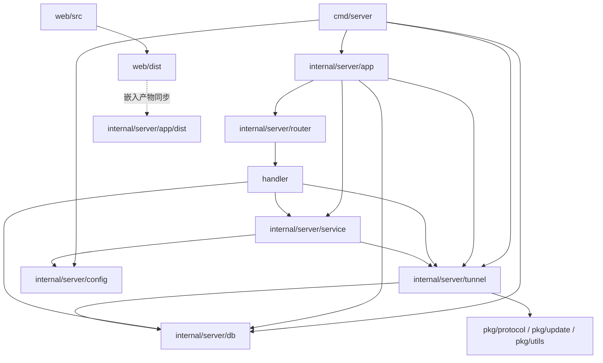

# GoTunnel 架构诊断报告

## 1. 背景

- 诊断时间：2026-03-23
- 诊断范围：`README.md`、`cmd/`、`internal/server/`、`internal/client/`、`pkg/`、`web/src/`
- 诊断目标：识别当前项目在目录层级、代码架构、依赖方向、配置模型、文档一致性和测试覆盖上的主要问题，为后续重构提供明确顺序
- 已执行验证：
  - 阅读核心装配、路由、服务、隧道、存储、配置、前端 API 代码
  - 执行 `go test ./...`，当前通过；说明仓库在编译和现有测试层面可用，但不代表边界设计健康

## 2. 系统现状概览

当前系统整体仍是单体服务，但内部已经出现多套职责边界并存的情况：HTTP 管理面、隧道运行时、配置读写、SQLite 持久化、前端 SPA 嵌入都在一个进程内完成，模块之间更多是“直接互相调用”，而不是稳定的应用层边界。

当前目录组织有几个明显特征：

- `cmd/server/main.go` 直接承担配置加载、数据库初始化、TLS 设置、运行时配置注入、Web 服务启动、信号处理等装配职责。
- `internal/server/router` 负责 HTTP 路由，但 `handler` 已经包含部分业务编排和校验逻辑。
- `internal/server/tunnel.Server` 同时承载隧道运行时、客户端会话、远程操作入口、流量统计、安装 token 校验路径等职责。
- 前端源码位于 `web/`，但服务端嵌入目录又单独维护一份 `internal/server/app/dist`，构建产物边界不清晰。

## 3. 关键问题清单

### 问题 1：文档与代码现状明显漂移

- 优先级：P1
- 现象 / 证据：
  - `README.md:219-233` 仍声明存在 `internal/server/plugin`、`internal/client/plugin`、`pkg/plugin` 等目录。
  - `README.md:241-258` 仍描述基于 `goja` 的 JS 插件系统。
  - `README.md:337-352` 仍描述 `GET /api/plugins` 插件管理接口。
  - 当前仓库实际 `internal/server` 下并无 `plugin/` 目录，路由中也没有 `api/plugins` 注册，见 `internal/server/router/router.go:36-115`。
- 影响：
  - 新开发者会被 README 误导，理解出一个并不存在的插件子系统。
  - 文档无法作为重构依据，容易造成“按文档改坏当前系统”的二次偏差。
  - 对外接口说明与实际实现不一致，后续测试和前端联调成本升高。
- 建议修改方向：
  - 先做文档收敛，删除或标注已下线能力。
  - 将 README 中“当前能力”和“历史设计/规划能力”分开。
  - 后续所有新增接口改为从路由注册与 Swagger 生成结果反推文档，避免手写漂移。

### 问题 2：路由装配依赖运行时类型断言，接口契约没有在编译期收敛

- 优先级：P0
- 现象 / 证据：
  - `internal/server/router/router.go:37-47` 在 `SetupRoutes` 中对 `serverRuntime` 做 `service.RemoteOpsRuntime` 断言，对 `clientStore` 做 `db.InstallTokenStore` 断言，失败直接 `panic`。
  - `internal/server/app/app.go:26-33`、`cmd/server/main.go:104-109` 通过具体实现对象注入，默认靠调用方“恰好满足所有隐藏契约”。
- 影响：
  - 启动时才暴露依赖不满足问题，属于典型的运行时装配风险。
  - `router` 包对下层真实能力的依赖被隐藏在实现细节里，接口命名不能真实反映需求。
  - 测试替身编写困难，mock 一旦漏实现某个隐含接口，就会在运行时崩溃而不是编译失败。
- 建议修改方向：
  - 用显式组合接口替代运行时断言，例如面向路由定义 `RouteDependencies` 或明确的 `InstallRuntime`、`RemoteOpsRuntime`、`StatusRuntime` 组合。
  - 将 `SetupRoutes` 的入参从“若干松散接口 + 类型断言”改成单个装配对象，所有依赖在编译期声明完整。
  - 将 `panic` 型装配失败改成启动前显式校验和错误返回。

### 问题 3：HTTP 适配层承担了过多业务编排职责

- 优先级：P1
- 现象 / 证据：
  - `internal/server/router/handler/client.go:14-28` 中 `ClientHandler` 同时依赖 `db.ClientStore`、`service.ConfigService`、`ClientRuntimeInterface`、`service.RemoteOpsService`。
  - `internal/server/router/handler/client.go:86-116` 在 handler 层执行客户端 ID 校验、规则数量校验、存在性检查、创建持久化对象。
  - `internal/server/router/handler/client.go:182-209` 在 handler 层直接读取、修改、回写 `db.Client`。
  - `internal/server/router/handler/config.go:63-97` 在 handler 层手工将 DTO 转换为 `service.ConfigUpdate`。
- 影响：
  - handler 不再只是 HTTP 协议适配层，而是业务入口层，导致业务规则分散在 `handler`、`service`、`tunnel` 三处。
  - 复用困难。CLI、后台任务、未来 RPC 接口若要复用同一业务，只能重新拼接一遍逻辑。
  - 单元测试只能以 HTTP 为入口才能覆盖关键逻辑，反馈慢且定位难。
- 建议修改方向：
  - 将“客户端创建/更新/删除/推送/重启/远程操作”收敛成应用服务层。
  - handler 只负责参数绑定、鉴权、调用应用服务、统一错误映射。
  - DTO 与领域输入对象在 service 层边界转换，不让 handler 直接操作存储模型。

### 问题 4：`internal/server/tunnel.Server` 已演化为 God Object

- 优先级：P0
- 现象 / 证据：
  - `internal/server/tunnel/server.go:31-53` 的 `Server` 同时持有客户端存储、流量存储、端口管理、会话集合、TLS、连接数控制、主监听器、日志会话。
  - `internal/server/tunnel/server_session.go` 负责连接接入、认证、安装 token 检查、客户端注册、会话建立、心跳循环。
  - `internal/server/tunnel/server_control.go` 负责配置下发、客户端状态、断开连接、持久化在线信息。
  - `internal/server/tunnel/server_runtime.go:66-125` 继续暴露远程操作和配置重载相关能力。
- 影响：
  - 任何关于客户端生命周期、远程控制、端口监听、流量统计的修改，都必须进入同一个核心对象，风险集中。
  - 对象测试面过大，重构时很难做到局部替换。
  - 当前服务端核心抽象不是“应用服务 + 基础设施”，而是“一个超大运行时对象 + 周边函数”，演进成本会持续抬升。
- 建议修改方向：
  - 按职责拆分为至少四类组件：连接接入/Auth、客户端会话管理、代理监听管理、远程操作通道。
  - `tunnel.Server` 保留为最薄的 facade 或 orchestration root，不再直接承载全部状态。
  - 将日志会话、截图、shell、系统状态查询从隧道主对象中剥离到独立 runtime service。

### 问题 5：存储模型直接依赖协议层 DTO，领域边界被打穿

- 优先级：P1
- 现象 / 证据：
  - `internal/server/db/interface.go:3-25` 中 `db.Client` 与 `ClientStore` 直接使用 `protocol.ProxyRule`。
  - `internal/server/db/sqlite.go:111-239` 在 SQLite 层直接序列化/反序列化 `protocol.ProxyRule` JSON。
  - `internal/server/tunnel/server.go:56-68` 的 `ClientSession` 也直接保存 `[]protocol.ProxyRule`。
- 影响：
  - 通讯协议一旦调整字段，持久化层和运行时层都会被连带修改。
  - 数据库存储结构隐式耦合网络协议，不利于做版本演进和兼容层。
  - 后续若引入更明确的业务规则模型，会面临大面积替换成本。
- 建议修改方向：
  - 将规则拆成三层模型：传输 DTO、领域模型、持久化模型。
  - SQLite 层只关心领域或持久化模型，不直接 import `pkg/protocol`。
  - 在 service 层承担模型转换，避免协议对象四处漂移。

### 问题 6：配置模型把“持久化配置”“运行时配置”“需重启配置”混在一起

- 优先级：P1
- 现象 / 证据：
  - `internal/server/service/config.go:40-47` 的 `ConfigService` 同时承担快照、更新、重载、读取最大代理数。
  - `internal/server/service/config.go:78-147` 更新配置时，先写入 YAML，再立即调用 `runtime.ApplyRuntimeConfig(...)`。
  - `internal/server/service/config.go:150-151` 又提供 `Reload()`。
  - 但 `internal/server/tunnel/server_runtime.go:122-125` 明确返回 `hot reload not supported, please restart the server`。
  - 前端仍暴露 `reloadConfig()`，见 `web/src/api/index.ts:21`。
  - `cmd/server/main.go:91-114` 启动阶段又会自动生成 Web 凭据并落盘，进一步把启动副作用和配置持久化耦合在一起。
- 影响：
  - API 语义对调用方不诚实：系统看上去支持 reload，实际不支持。
  - 哪些配置可以热生效、哪些必须重启，没有形成显式契约。
  - 配置更新的副作用太多，既影响运行时又影响文件系统，不利于测试和权限控制。
- 建议修改方向：
  - 明确区分三类配置：
    - 可热生效配置
    - 需重启生效配置
    - 启动时生成的引导性配置
  - `/config/reload` 若短期不支持，应从 API 和前端移除，或改成返回结构化能力说明。
  - 将“更新配置文件”和“应用运行时配置”拆成两个明确步骤，不在同一个 service 方法中隐式完成全部动作。

### 问题 7：包结构与职责命名存在重叠，增加维护认知成本

- 优先级：P2
- 现象 / 证据：
  - `pkg/update` 与 `internal/server/update` 同时存在，前者是通用下载替换逻辑，后者是服务端更新编排，名称非常接近但层级不同。
  - `internal/server/app/dist` 与 `web/dist` 同时存在构建产物，见 `internal/server/app/app.go:15`、`find internal/server/app -maxdepth 2` 与 `find web -maxdepth 2` 结果。
  - `web/src/api/index.ts:28-182` 中维护大量前端手写接口类型，而后端同时存在 `internal/server/router/dto/`。
- 影响：
  - 模块职责只能靠经验记忆，不靠命名即可区分。
  - 前端构建产物复制链路不透明，容易出现“源码已更新，嵌入产物未更新”的发布事故。
  - API 类型无法自动对齐，前后端契约漂移会继续累积。
- 建议修改方向：
  - 重命名或重组更新模块，例如将 `internal/server/update` 语义收敛为 `internal/server/application/update` 或 `internal/server/updateapp`。
  - 明确前端产物唯一来源，约束 `internal/server/app/dist` 只作为嵌入目录，不作为独立维护目录。
  - 评估用 OpenAPI 生成前端类型，减少 `web/src/types` 和 `web/src/api` 手工同步。

### 问题 8：测试覆盖集中在底层，胶水层和边界层缺少保护

- 优先级：P1
- 现象 / 证据：
  - 本次执行 `go test ./...` 通过，但测试文件主要集中在 `internal/server/config`、`internal/server/db`、`internal/server/tunnel`。
  - `internal/server/router/`、`internal/server/router/handler/`、`internal/server/service/`、`internal/server/update/`、`internal/server/app/` 当前无测试文件。
- 影响：
  - 真正容易退化的边界层没有测试保护，尤其是参数绑定、错误映射、接口契约和装配逻辑。
  - 一旦开始做分层重构，最先出问题的通常不是隧道底层，而是 HTTP 到 service 的胶水逻辑。
  - 文档漂移、契约漂移、类型断言失败这类问题不会被现有测试及时发现。
- 建议修改方向：
  - 优先为 `router -> service` 交互增加接口级测试。
  - 为配置更新、安装 token、远程操作入口建立 mock 驱动的单元测试。
  - 增加最小化 contract test，验证前后端关键 DTO 字段是否匹配。

## 4. 后续接口与边界调整方向

本次报告不改代码，但建议后续重构时优先遵守以下边界约束：

- 将 `router` 对 `serverRuntime`、`clientStore` 的隐式依赖改成显式组合接口，消除运行时类型断言。
- 将 `db.Client` 与 `protocol.ProxyRule` 解耦，引入独立的领域规则模型。
- 将“热更新配置”和“需重启生效配置”明确分开建模，不再继续暴露错误语义的 `/config/reload`。
- 将远程操作能力（日志、截图、shell、系统状态）从 `tunnel.Server` 中拆成独立应用服务，`tunnel` 只负责连接与通道。

## 5. 改造路线图

### 第一阶段：边界收敛和文档对齐

- 修正 README，使其只描述当前真实存在的目录、接口和能力。
- 删除或下线 `/config/reload` 的误导性入口，至少先在前后端返回一致的“不支持热重载”语义。
- 将 `router.SetupRoutes` 的依赖改成编译期可校验的组合接口，移除启动期 `panic`。
- 为 `router`、`handler`、`service` 增加最小化测试，先把当前边界锁住。

### 第二阶段：服务层重组与领域模型解耦

- 新建应用服务层，吸收 handler 中的业务编排逻辑。
- 将客户端、规则、远程操作、配置管理拆成独立应用服务。
- 引入独立的规则领域模型，去掉 `db` 对 `protocol` 的直接依赖。
- 把配置更新流程拆成“持久化更新”和“运行时应用”两个明确动作。

### 第三阶段：模块化与长期演进

- 拆分 `tunnel.Server`，降低单一核心对象的状态和职责密度。
- 统一更新模块和前端构建产物命名，减少目录语义重叠。
- 基于 Swagger / OpenAPI 生成前端 API 类型和客户端，降低手工同步成本。
- 根据未来产品方向决定是否需要真正支持热重载、插件系统或多端控制面；在此之前不要让文档超前于实现。

## 6. 测试建议

### 已完成验证

- `go test ./...` 通过。

### 建议补齐的测试

- `router -> service` 交互测试：
  - 配置更新成功/失败
  - 远程操作错误映射
  - 安装 token 相关接口
  - 客户端创建、更新、删除的边界条件
- `tunnel.Server` 细粒度单元测试：
  - 客户端注册与断开
  - 配置下发与监听器重建
  - 心跳超时与清理
- API 契约测试：
  - 前端使用的关键 DTO 字段是否与后端响应一致
  - 不支持的配置重载能力是否对前端明确暴露

## 7. 附录：关键证据文件

以下文件是本次诊断的主要依据，后续修改建议优先从这些入口着手：

1. `README.md`
2. `cmd/server/main.go`
3. `internal/server/router/router.go`
4. `internal/server/router/handler/client.go`
5. `internal/server/tunnel/server.go`
6. `internal/server/tunnel/server_runtime.go`
7. `internal/server/db/interface.go`
8. `internal/server/db/sqlite.go`
9. `internal/server/config/config.go`
10. `internal/server/app/app.go`
11. `web/src/api/index.ts`

注：附录刻意保留为“少量高信号文件”，后续如进入实施阶段，再按专题继续细化到 `service/`、`dto/`、`web/src/types/` 等子模块。
